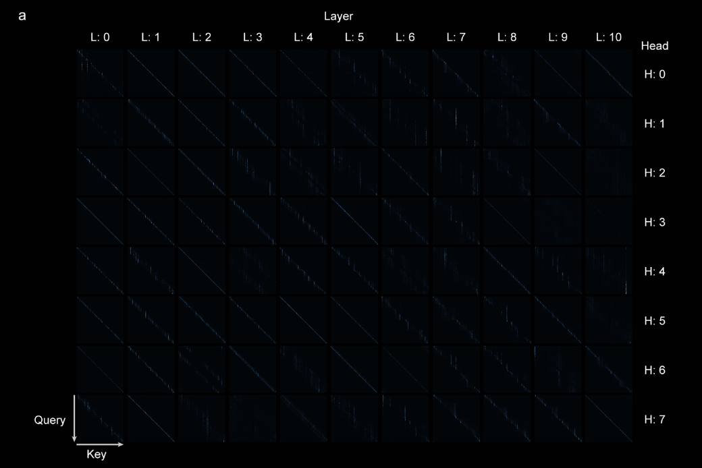
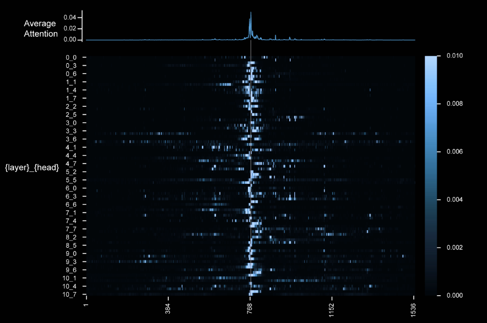
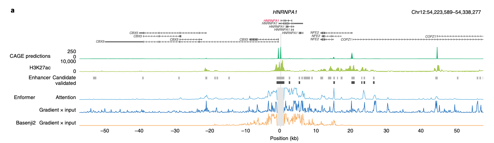

# Enformer Attention Analysis - Reading Notes
## Avsec et al. 2021, Sections 3-4 (Pages 2-4)

**Date:** October 28, 2025  
**Reading time:** 1 hour  
**Focus:** How they visualize attention for biological signals

---

## Section 1: Attention Visualization Methods

### 1.1 How do they visualize attention across layers?




**Gradient × Input method:**
- What is it? A method that computes the product of the gradient of the output with respect to the input, weighted by the input itself.  General to any differentiable model.
- When do they use it? For cell-type-specific TSS enhancer prediction.
- Key formula/approach: Absolute value of gradient × one-hot encoded input

**Attention weights method:**
- What is it? A method that visualizes the transformer attention weights directly from the model's output.  Specific to transformers.
- When do they use it? For TSS enhancer prediction and general attention visualization.
- Key formula/approach? From output, average attn weights across all layers and heads.

**Key differences:**
- Cell-type-specific vs agnostic: Gradient × Input is more cell-type-specific, while Attention Weights can be more agnostic.
- Computational efficiency: Attention Weights are generally more computationally efficient to compute.
- Architectures supported: Gradient × Input can be used with any differentiable model, while Attention Weights are specific to transformer architectures.
---

### 1.2 Visualization Techniques Used



**From Figure 2a (HNRNPA1 locus):**
- What tracks do they show together?
  * H3K27ac ChIP-seq
  * CAGE Predictions
  * Enhancer annotations

- How do they overlay attention on genomic features?  Long line plots below the tracks

- Color schemes that work: blue, orange

- What makes the visualization interpretable? ...

---

## Section 2: Biological Patterns in Attention

### 2.1 What biological signals emerge from attention?

**Enhancers:**
- How do they identify them?
- Distance ranges covered:
- Correlation with what experimental data? (e.g., H3K27ac)

**Regulatory elements:**
- Promoters:
- Distal enhancers (>20kb):
- Other elements:

**Conservation patterns:**
- Do they mention conservation?
- How does attention relate to functional importance?

---

### 2.2 Key Observations from Figure 2

**Figure 2a - HNRNPA1 gene attention:**
- What positions get high attention?
- Do validated enhancers match high attention?
- Basenji2 comparison: what's different?

**Figure 2b - Enhancer prioritization:**
- Performance metrics:
- How well does attention identify true enhancers?
- ABC score comparison:

**Figure 2c-d - TAD boundaries:**
- What pattern do they see at boundaries?
- "Red stripe" = 
- "Blue blocks" = 
- Biological interpretation:

---

## Section 3: Making Attention Clinician-Friendly

### 3.1 How to explain attention to non-ML audiences

**What works:**
- Language to use:
  * "This shows..."
  * "Red areas indicate..."
  * Avoid jargon like:

**Visual strategies:**
- Linking to known biology (H3K27ac peaks):
- Showing concordance with experimental data:
- Using standard genomic browser views:

---

### 3.2 Validation Strategies

**How they validate biological relevance:**
1. 
2. 
3. 

**Experimental comparisons:**
- CRISPRi data:
- ChIP-seq data:
- Other:

---

## Section 4: Application to ESM2 (Proteins)

### 4.1 Direct parallels: Genomics → Proteins

| Enformer (genomics)    | ESM2 (proteins)                  | My approach |
| ---------------------- | -------------------------------- | ----------- |
| Attention to enhancers | Attention to functional domains? |             |
| H3K27ac validation     | UniProt annotations?             |             |
| TSS-centric analysis   | Active site-centric?             |             |
| Distance patterns      | Secondary structure?             |             |

---

### 4.2 What can I borrow for ESM2 analysis?

**Visualization approaches:**
- 
- 
- 

**Validation strategies:**
- 
- 
- 

**Making it interpretable:**
- 
- 
- 

---

## Section 5: Key Insights & Questions

### Insights that surprised me:
1. 
2. 
3. 

### Questions I still have:
1. 
2. 
3. 

### Technical details to investigate later:
- 
- 
- 

---

## Section 6: Implementation Notes for My Work

### For Wednesday's utils.py implementation:

**Functions I need:**
```python
# Based on Enformer approach:
def extract_attention_enformer_style():
    # Key: aggregate across heads, show with genomic context
    pass

def plot_with_functional_annotations():
    # Overlay attention on known domains (like H3K27ac overlay)
    pass
```

**Visualization requirements:**
- Heatmap style:
- Annotations to include:
- Color scheme:

---

### For Thursday's systematic analysis:

**Validation approach:**
- Compare attention peaks to what biological annotations?
- What's the protein equivalent of "validated enhancers"?
- How to quantify agreement?

---

## Section 7: Figures & Screenshots

### Figure 2a key elements:
- [ ] Screenshot saved to `outputs/enformer_fig2a.png`
- Key observation:

### Figure 2b benchmark:
- [ ] Screenshot saved
- Performance numbers to remember:

### Figure 2c-d TAD analysis:
- [ ] Screenshot saved  
- Pattern I want to look for in proteins:

---

## Section 8: Quick Reference

### Key terminology:
- **Contribution scores:**
- **Gradient × input:**
- **Attention weights:**
- **Cell-type specific:**
- **TAD boundaries:**

### Important metrics:
- Enhancer recall (auPRC):
- Distance ranges:
- Performance vs Basenji2:

---

## Action Items After Reading

- [ ] Summarize in 3 sentences for week reflection
- [ ] Update `docs/week1_analysis_plan.md` with Enformer insights
- [ ] List 2-3 techniques to implement Wednesday
- [ ] Note any clarifying questions for further research

---

## Bottom Line (TL;DR after reading)

**Main takeaway about attention visualization:**


**Main takeaway about biological validation:**


**Main application to my ESM2 work:**