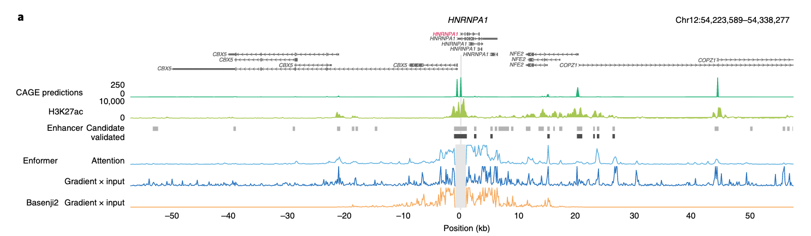
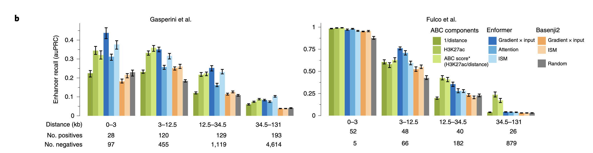
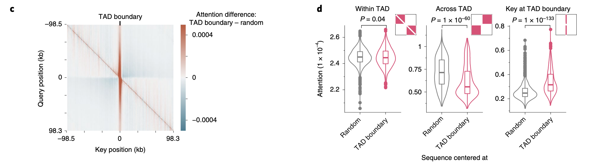
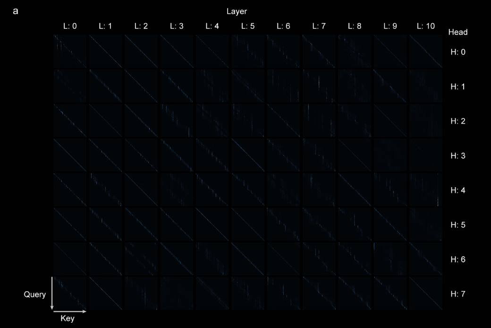
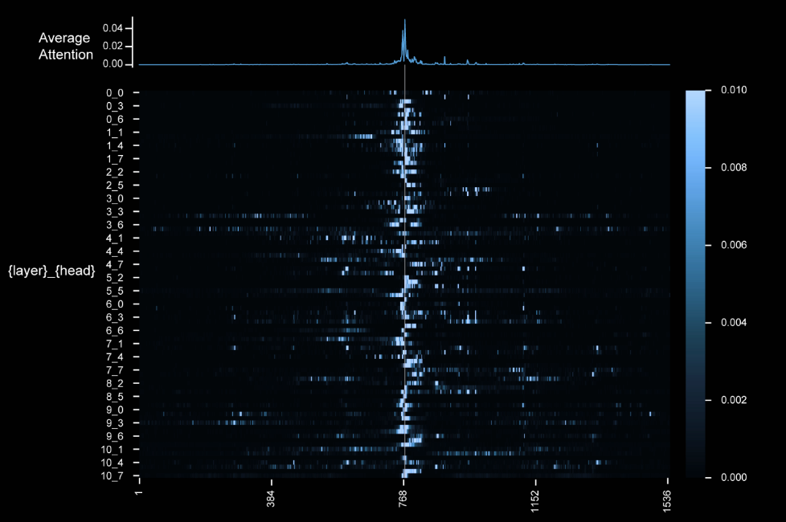

# Enformer Attention Analysis - Reading Notes

**Avsec et al. 2021, Sections 3-4**
**Date:** October 28, 2025  
**Reading time:** 1 hour  
**Focus:** How they visualize attention for biological signals

## Section 1: Attention Visualization Methods

### 1.1  **Gradient × Input method:**
- What is it? A method that computes the product of the gradient of the output with respect to the input, weighted by the input itself.  General to any differentiable model.
- When do they use it? For cell-type-specific TSS enhancer prediction.
- Key formula/approach: Absolute value of gradient × one-hot encoded input

### 1.2  **Attention weights method:**
- What is it? A method that visualizes the transformer attention weights directly from the model's output.  Specific to transformers.
- When do they use it? For TSS enhancer prediction and general attention visualization.
- Key formula/approach? From output, average attn weights across all layers and heads.

### 1.3  **Key differences:**
  - Cell-type-specific vs agnostic: Gradient × Input is more cell-type-specific, while Attention Weights can be more agnostic.
  - Computational efficiency: Attention Weights are generally more computationally efficient to compute.
  - Specificity: Gradient × Input may provide more specific insights into input-output relationships.
  - Architectures supported: Gradient × Input can be used with any differentiable model, while Attention Weights are specific to transformer architectures.
  - Performance - in Fig2b and 2c, Gradient × Input outperforms Attention Weights for TSS prediction.

## Section 2: Biological Patterns in Attention

### 2.1 What biological signals emerge from attention?

**Enhancers (primary focus):**
- How identified: H3K27ac ChIP-seq peaks correlating with attention weights
- Distance ranges: Both promoter-proximal (<2kb) and distal (>20kb, up to 100kb)
- Validation: CRISPRi-validated enhancers from Fulco et al. and Gasperini et al.
- Key finding: Attention weights highlight distal enhancers that Basenji2 misses

**Cell-type specificity:**
- Gradient × input: Cell-type-specific (computed w.r.t. K562 CAGE track)
- Attention weights: Shared across cell types but still identify relevant enhancers
- Performance: Cell-type-specific contribution scores outperform agnostic ones (Extended Data Fig. 7c)

**H3K27ac correlation:**
- Contribution scores "correlated with H3K27ac"
- H3K27ac marks active enhancers and promoters
- Used as ground truth for validating attention patterns

**TAD (Topologically Associating Domain) boundaries:**
- Figure 2c-d analysis
- Model attends more strongly to TAD boundaries
- Biological relevance: TADs organize enhancer-promoter interactions

### 2.2 Key Observations from Figure 2

**Figure 2a - HNRNPA1 gene attention:**
- High attention positions: Distal enhancers (>20kb from TSS)
- Validated enhancers: CRISPRi screen confirmed functional impact
- Basenji2 comparison: Enformer captures >20kb enhancers; Basenji2 shows zeros beyond 20kb
- H3K27ac peaks align with high attention regions

**Figure 2b - Enhancer prioritization:**
- Performance metrics: auPRC for enhancer-gene pair classification
- Distance stratification: Performance maintained even at >20kb distances
- Enformer attention weights: Competitive with ABC score (H3K27ac/distance)
- Key result: Attention-based scoring can prioritize causal enhancers

**Figure 2c-d - TAD boundaries:**
- Pattern: "Red stripe in the center at key = 0" 
- Red stripe = Model attends MORE to TAD boundary positions
- Blue blocks = Model attends LESS across TAD boundaries (off-diagonal quadrants)
- Biological interpretation: Model learns 3D genome organization from sequence alone

# Section 3: Translation to Your Work

## 3.1. **Why is attention useful for rare disease variants?**
 - Identifying regulatory elements: Attention can highlight distal enhancers (>20kb) and promoters relevant to gene regulation.
 - Do these elements disrupt gene expression when mutated?

- How to identify a pathogenic variant?
  - Does high attention indicate pathogenicity?
  - Does a variant's change in attention indicate pathogenicity?

## 3.2 Biological Insights:
- Attention can reveal cell-type-specific regulatory elements that may be relevant for understanding rare disease mechanisms.
- Long-range dependencies matter (100kb context)
- Cell-type-specific contribution scores outperform agnostic ones
- Attention can identify functional elements without explicit training

## 3.3 Application to Your Project:

- Use attention weights for explanatory, predictive, or discovery purposes.
- Integrate attention-based insights into variant interpretation pipelines.
- Use attention weights to prioritize regulatory elements for functional validation.
- Collaborate with experimentalists to validate high-priority variants.

For further examples, `see docs/use_cases/rare_disease_attention_use_cases.md`

## 3.4 Visualization Techniques:

- From the supplemental figures:

